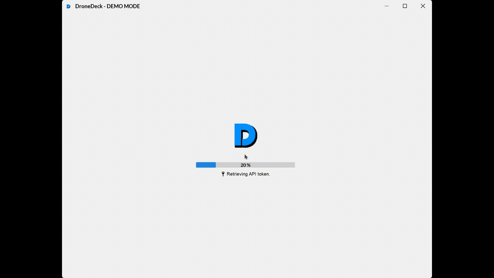
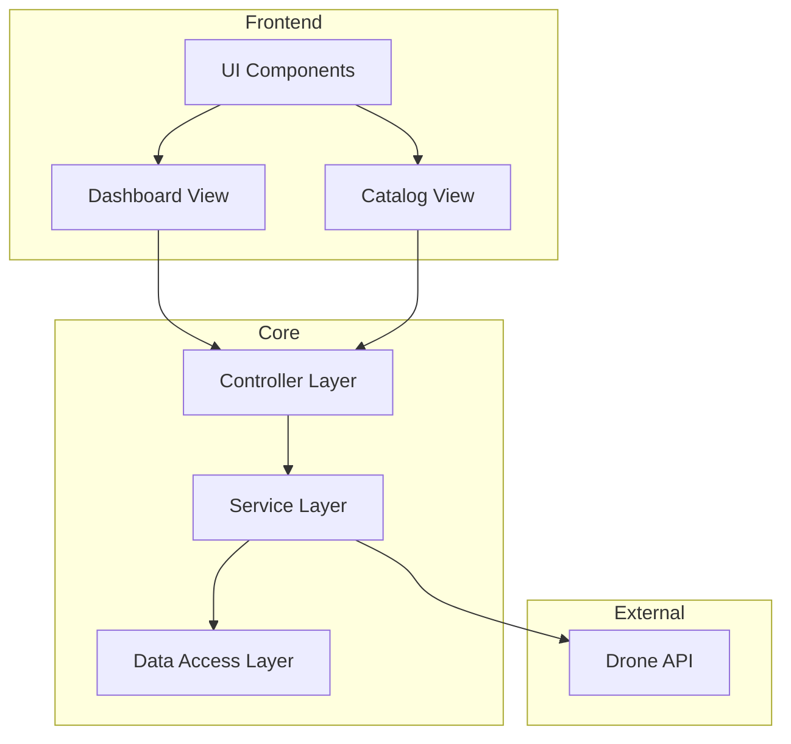

# DroneDeck v1.2.0

[](https://www.oracle.com/java/)
[](https://docs.oracle.com/javase/tutorial/uiswing/)
[](https://restfulapi.net/)
[](https://docs.oracle.com/javase/tutorial/essential/concurrency/)
[](https://en.wikipedia.org/wiki/Model%E2%80%93view%E2%80%93controller)
[](https://junit.org/junit5/)
[](https://docs.oracle.com/javase/tutorial/uiswing/components/index.html)
[](LICENSE)

## 📋 Table of Contents
- [Overview](#overview)
- [What's New in v1.2.0](#whats-new-in-v120)
- [Quick Start](#quick-start)
- [Demo](#demo)
- [Documentation](#documentation)
- [Architecture](#architecture)
- [🚀 Running the Application](#-running-the-application)
- [🔧 Development Setup](#-development-setup)
- [🔑 API Access Setup](#-api-access-setup)
- [📚 Additional Resources](#-additional-resources)
- [📄 License](#-license)

## Overview

This repository contains the source code and supporting documentation for the **DroneDeck** project, developed as part of the **Object-Oriented Programming in Java** course at Frankfurt UAS (Winter 2024). The goal is to create a Java application with a graphical user interface (GUI) to interact with a drone simulation system using a [RESTful API](http://dronesim.facets-labs.com).

## What's New in v1.2.0

- **✨ Demo Mode**: Run without API access (`java -jar DroneDeck.jar --demo`)
- **🔄 Enhanced Data Sync**: Improved local storage synchronization

## Quick Start

```bash
# Run with API access (requires credentials)
java -jar DroneDeck.jar

# Or run in demo mode (no API access needed)
java -jar DroneDeck.jar --demo
```

## Demo



## Documentation
For comprehensive project documentation, including user handbook and technical details, see our [Full Documentation](Docs.md).

## Architecture

DroneDeck follows a clean, modern architecture focused on scalability and maintainability:



**Key Technologies:**
- Java Swing with modern FlatLaf UI components
- REST API integration with token authentication
- Multithreaded data processing for performance
- Local data caching for offline capabilities

---

## 🚀 Running the Application

### Standard Mode (With API Access)

```bash
# Download DroneDeck.jar from the latest release
java -jar DroneDeck.jar
```

**Requirements:**
- ☕ Java 23+ ([Download](https://www.oracle.com/java/))
- 🖥️ Screen resolution: 1024x768+
- 🔑 DroneSim account with API token
- 🌐 Frankfurt UAS network access

### Demo Mode (No API Required)

```bash
# Perfect for testing without API access
java -jar DroneDeck.jar --demo
```

**Benefits:**
- No API token required
- Works outside university network
- Try all features with simulated data

## 🔧 Development Setup

### Required Tools

- [JDK 23](https://www.oracle.com/java/technologies/javase/jdk23-archive-downloads.html) - Java Development Kit
- [IntelliJ IDEA](https://www.jetbrains.com/de-de/idea/) - Recommended IDE
- [Git](https://git-scm.com/downloads) - Version Control

### Building From Source

1. Clone the repository
2. Open in IntelliJ IDEA
3. Build → Build Project
4. Run using:

   **Windows:**
   ```
   # Option 1: Use the included batch file
   RunDemoDroneDeck.bat
   
   # Option 2: Command line
   java -cp "out/production/DroneDeck;lib/*" main.java.DroneDeck --demo
   ```

   **macOS/Linux:**
   ```
   java -cp out/production/DroneDeck:lib/* main.java.DroneDeck --demo
   ```

## 🔑 API Access Setup

1. **Set the `DRONE_API_KEY` environment variable**:
   - Find your API token at [DroneSim](http://dronesim.facets-labs.com)
   - Setting this prevents manual key entry on each startup

2. **Off-campus access**:
   - API only accessible from Frankfurt UAS network
   - Install [FortiClient VPN](https://www.fortinet.com/de/support/product-downloads)
   - Connect using university credentials

---

## 📚 Additional Resources

- 📝 **Documentation**
  - [Notion Project Page](https://www.notion.so/zakabouj/DroneDeck-OOP-Java-Projcet-152408e5d09b8033b5aed50a06d138d8)
  - [Detailed Documentation](https://www.notion.so/zakabouj/DroneDeck-Documentation-152408e5d09b800bb222fb4f9c63cec0)
  
- 🎨 **Design**
  - [Figma Wireframes & Mockups](https://www.figma.com/design/lKYP3mLiFFFGDFb1HdLXus/DroneDeck-Mockup?node-id=80-33&t=G7z15kf5VyYzPZE0-0)

---

## 📋 Project Requirements

- 📄 [Project Requirements PDF](https://github.com/user-attachments/files/18007575/2024_winter_project_description.pdf)
- 🎯 [Milestones Description PDF](https://github.com/user-attachments/files/18007586/milestones.pdf)


---

## 📄 License

This project is licensed under the MIT License - see the [LICENSE](./LICENSE) file for details.
