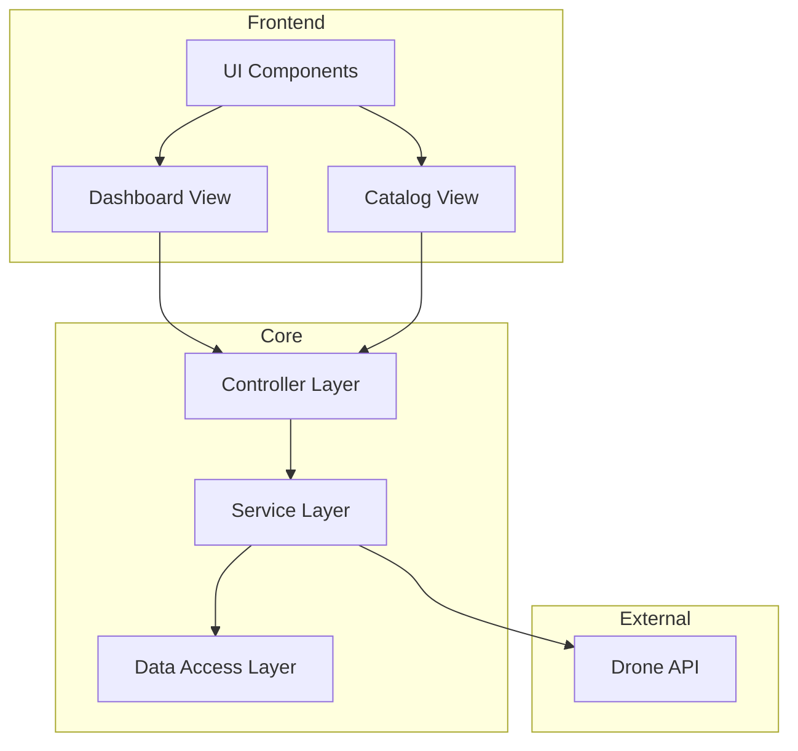

# DroneDeck

This repository contains the source code and supporting documentation for the **DroneDeck** project, developed as part of the **Object-Oriented Programming in Java** course at Frankfurt UAS (Winter 2024). The goal is to create a Java application with a graphical user interface (GUI) to interact with a drone simulation system using a [RESTful API](http://dronesim.facets-labs.com).

## Demo

## Documentation
For comprehensive project documentation, including user handbook and technical details, see our [Full Documentation](Docs.md).

## Architecture

DroneDeck follows a clean, modern architecture focused on scalability and maintainability:

**Key Technologies:**
- Java Swing with modern FlatLaf UI components
- REST API integration with token authentication
- Multithreaded data processing for performance
- Local data caching for offline capabilities

---

## Getting Started

### Tools You Need to Download

1. **IntelliJ IDEA** (Recommended IDE):  
   Download and install [IntelliJ](https://www.jetbrains.com/de-de/idea/)
   **Recommended Installation Tips**:
   - Check **Add "bin" folder to the PATH**
   - Check **Add "Open Folder as Project"**
   - Check **.java** under "Create Associations"

2. **Git** (Version Control):  
   Download [Git](https://git-scm.com/downloads)

3. **GitHub Desktop** (Recommended):  
   Download [GitHub Desktop](https://github.com/apps/desktop)

4. **Postman** (Optional, for API Testing):  
   Download [Postman](https://www.postman.com/downloads/)

5. **JDK 23** (Java Development Kit):  
   Download the latest [JDK 23](https://www.oracle.com/java/technologies/javase/jdk23-archive-downloads.html)

### Environment Setup

To successfully run the application and interact with the DroneSim API, you will need to set up an environment variable:

1. **Set the `DRONE_API_KEY` environment variable**:
   - The value of `DRONE_API_KEY` should be the API token, which you can find after logging in to [DroneSim](http://dronesim.facets-labs.com).

2. **Accessing the API from outside Frankfurt UAS**:  
   If you're working from a location other than **Frankfurt UAS**, and you want to connect to the API, you will need to download and set up [FortiClient VPN](https://www.fortinet.com/de/support/product-downloads) to connect to the Frankfurt UAS network. The API can only be accessed from within this network.

---

## Additional Resources
- **[Notion](https://www.notion.so/zakabouj/DroneDeck-OOP-Java-Projcet-152408e5d09b8033b5aed50a06d138d8) for Documentation**:  
  - [Project Documentation](https://www.notion.so/zakabouj/DroneDeck-Documentation-152408e5d09b800bb222fb4f9c63cec0)  
- **[Figma](https://www.figma.com/design/lKYP3mLiFFFGDFb1HdLXus/DroneDeck-Mockup?node-id=80-33&t=G7z15kf5VyYzPZE0-0) for Wireframes and Mokups**

---

## Project Requirements and Files

### Linked PDF Files:
- [**Project Requirements**](https://github.com/user-attachments/files/18007575/2024_winter_project_description.pdf)
- [**Milestones Description**](https://github.com/user-attachments/files/18007586/milestones.pdf)

---

## License

This project is licensed under the MIT License - see the [LICENSE](./LICENSE) file for details.
